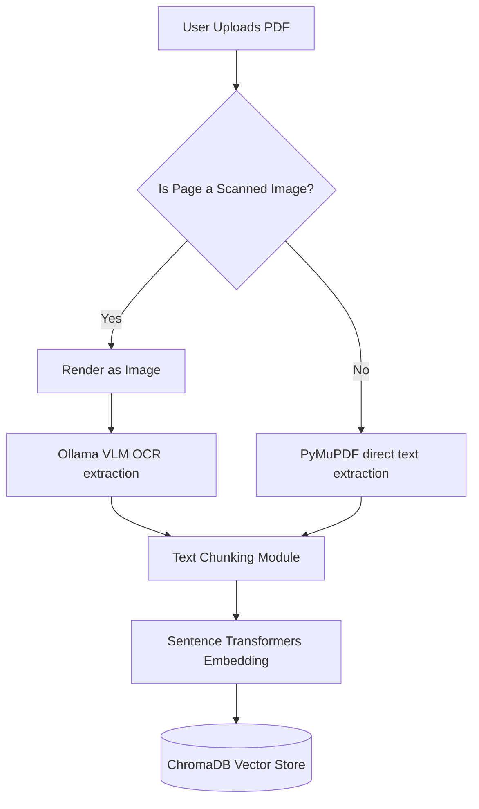
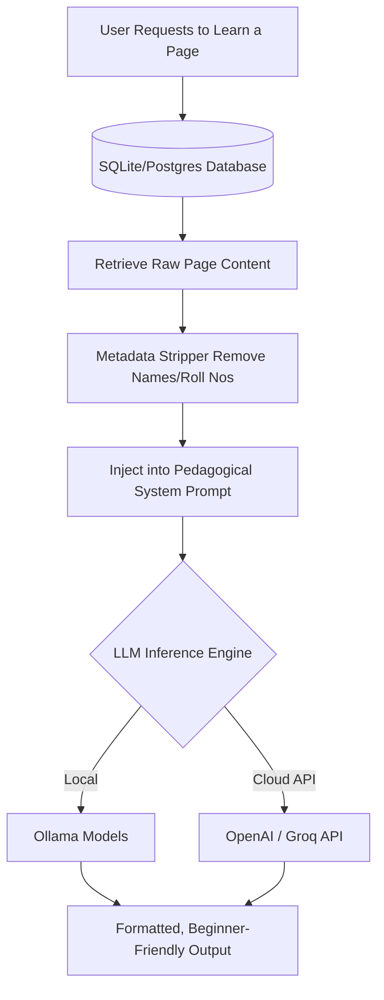

<div align="center">

# 🧠 **AI BOOK TEACHER** 📚

### **Transforming Static Books & Handwritten Notes into Interactive AI Tutors**

[](https://www.python.org/)
[](https://fastapi.tiangolo.com)
[](https://ollama.ai)
[](https://trychroma.com)
[](https://github.com/astral-sh/uv)

<br/>

<a href="https://youtu.be/3lOMYnohyYk">
  
</a>
<p><i>Click the image above to watch the full system demo in action.</i></p>

</div>

---

<br/>

# 📖 **OVERVIEW**

**AI Book Teacher** is a robust, privacy-first Retrieval-Augmented Generation (RAG) system built to act as your personalized tutor. Simply upload a textbook, a digital PDF, or even a scan of handwritten notes, and the system intelligently extracts, cleans, and vectorizes the knowledge. 

When queried, it doesn't just return text—it strictly adopts a pedagogical framework to teach you the concepts logically, completely grounded in the source material.

---

<br/>

# ✨ **KEY FEATURES**

- 📚 **HYBRID DOCUMENT INGESTION** <br/> Seamlessly handles both native digital PDFs and scanned image-based notebooks. 
- 👁️ **VISION-LANGUAGE MODEL (VLM) OCR** <br/> Utilizes local Ollama VLMs to extract and transcribe complex handwritten text directly from scanned pages without summarizing or distorting the original notes.
- 🛡️ **PRIVACY-AWARE DATA STRIPPER** <br/> Automatically redacts personal metadata (Student Name, Roll No., School, Signatures) using targeted Regex heuristics to keep the LLM focused on teaching, not hallucinating user data.
- 🧠 **PEDAGOGICAL AI ENGINE** <br/> Employs rigorous system prompting to ensure the AI explains cause-and-effect, connects sequential ideas, and formats outputs cleanly for absolute beginners.
- ⚡ **ULTRA-FAST BACKEND** <br/> Built on FastAPI and managed by `uv` to ensure blazingly fast dependency resolution and API routing.

---

<br/>

# 🏗 **SYSTEM ARCHITECTURE**

The AI Book Teacher processes data in two main pipelines: **Ingestion** and **Teaching**.

## 1. INGESTION & OCR PIPELINE
How a book transforms from a raw PDF into an embedded knowledge base:



<br/>

## 2. THE AI TEACHING ENGINE
How the system handles user requests to learn specific concepts:



---

<br/>

# 🧠 **UNDER THE HOOD: HOW IT WORKS**

### 📄 SMART TEXT EXTRACTION (`ingestion_pipeline.py`)
When you upload a document, the application doesn't blindly parse it. It calculates the image-to-text ratio per page. If a page is heavily image-based (like a scanned notebook), it delegates reading to an **Ollama Vision Language Model (VLM)**. We explicitly prompt the VLM to act purely as a transcriber: *“Extract every handwritten word... Return plain text only. Do not summarize.”*

### 🕵️ DATA CLEANSING (`query.py`)
Handwritten notes often start with metadata ("Submitted by: John Doe, Roll No: 42"). To prevent the LLM from teaching you who the author is instead of the subject matter, the `strip_note_owner_metadata` function runs advanced regex filtering over the content before it ever reaches the AI. 

### 👨‍🏫 PEDAGOGICAL PROMPTING
The core of the "Teacher" aspect is the system prompt. The model is constrained by strict behavioral rules:
> *“Do not introduce new facts beyond what is necessary... Preserve the original order of ideas... Make all cause-effect relationships explicit... Organize into paragraphs and section headings.”*

This ensures the generated output isn't just a summary, but a structured lesson.

---

<br/>

# 🚀 **QUICKSTART GUIDE**

## PREREQUISITES
- **Python 3.11+**
- **[uv](https://github.com/astral-sh/uv)** (The incredibly fast Python package manager)
- **[Ollama](https://ollama.ai/)** (For local LLM and VLM inferences)

## 1. INSTALLATION

Clone the repository and jump into the project directory:
```bash
git clone https://github.com/your-username/ai-book-teacher.git
cd ai_book_teacher
```

Using `uv`, you can instantly create an isolated environment and sync all dependencies defined in the `pyproject.toml` and `uv.lock`:
```bash
uv sync
```
*(Alternatively, to strictly use `pip` under `uv`: `uv pip install -r requirements.txt`)*

## 2. ENVIRONMENT CONFIGURATION

Create a `.env` file in the root of the project to configure your models and API keys:

```ini
# .env
OPENAI_API_KEY=your_api_key_here
LLM_MODEL_NAME=llama3  # Or any model supported by Ollama/Groq
VLM_MODEL_NAME=llava   # Required for scanning handwritten notes
```

## 3. INITIALIZE THE DATABASE

Run Alembic to prepare your SQLite/Postgres database with the correct schemas:
```bash
uv run alembic upgrade head
```

## 4. RUN THE APPLICATION

Start the FastAPI application. It is highly optimized and will spin up on `localhost`:
```bash
uv run uvicorn backend.main:app --reload
```

- **Web App**: Navigate to `http://localhost:8000/`
- **API Playground**: Check out the Swagger UI at `http://localhost:8000/docs`

---

<br/>

# 🛠 **TECH STACK DEEP DIVE**

| Component | Technology Used | Reason |
| :--- | :--- | :--- |
| **Backend API** | FastAPI | High performance, asynchronous endpoints, auto-generated OpenAPI docs. |
| **Database ORM** | SQLAlchemy | Robust relational modeling for Books, Chapters, and Pages. |
| **Vector Engine** | ChromaDB | Lightweight, embedded vector storage optimized for RAG. |
| **PDF Processing** | PyMuPDF (`fitz`) | Extremely fast text parsing and image rendering from PDFs. |
| **Machine Learning** | LangChain, Hugging Face | Provides standard interfaces for text splitting and sentence-transformers. |

<br/>

<div align="center">
  <p>Built with ❤️ by the open-source AI community. <br> If you like this project, please consider giving it a ⭐ on GitHub!</p>
</div>
