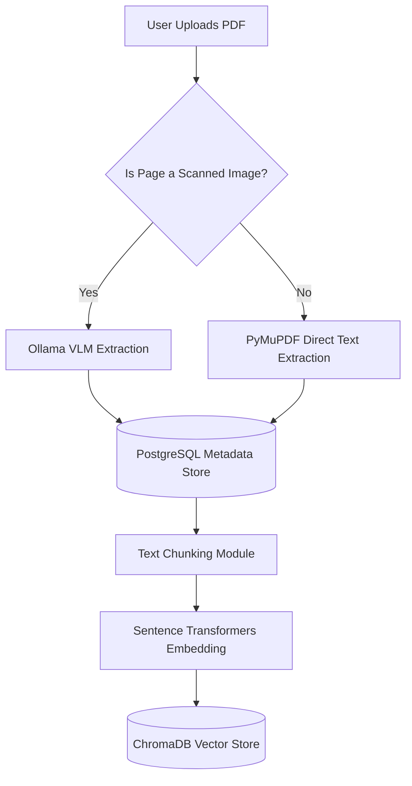
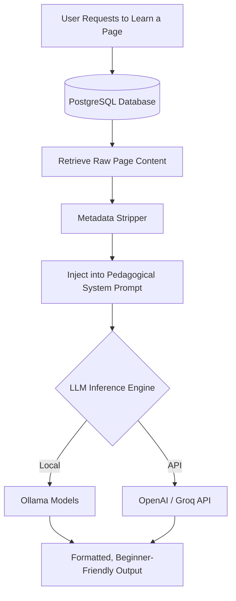

<div align="center">

# 🧠 **AI BOOK TEACHER** 📚

### **Transforming Static Books & Handwritten Notes into Interactive AI Tutors**

[](https://www.python.org/)
[](https://fastapi.tiangolo.com)
[](https://www.postgresql.org/)
[](https://ollama.ai)
[](https://trychroma.com)

<br/>

**[▶️ Watch the Full System Demo on YouTube](https://youtu.be/3lOMYnohyYk)**

</div>

---

<br/>

# 📖 **OVERVIEW**

**AI Book Teacher** is a Retrieval-Augmented Generation (RAG) system built to act as your personalized tutor. Upload a textbook, a digital PDF, or a scan of handwritten notes, and the system intelligently extracts, cleans, and vectorizes the knowledge to teach you the concepts logically.

---

<br/>

# ✨ **KEY FEATURES**

- 📚 **HYBRID DOCUMENT INGESTION** <br/> Handles both native digital PDFs and scanned image-based notebooks. 
- 👁️ **WHY WE USE VLM INSTEAD OF OCR** <br/> Traditional OCR models struggle heavily with messy handwritten notes taken from phone cameras. Instead, we use local **Ollama Vision Language Models (VLMs)** to accurately transcribe complex handwritten text directly from scanned pages.
- 🛡️ **PRIVACY-AWARE DATA STRIPPER** <br/> Automatically redacts personal metadata (Student Name, Roll No., School) using Regex to keep the LLM focused on teaching, not user data.
- 🧠 **PEDAGOGICAL AI ENGINE** <br/> Uses strict system prompting to ensure the AI explains concepts cleanly for absolute beginners.

---

<br/>

# 🏗 **SYSTEM ARCHITECTURE**

## 1. INGESTION PIPELINE



<br/>

## 2. THE AI TEACHING ENGINE



---

<br/>

# 🚀 **QUICKSTART GUIDE**

## 1. INSTALLATION

First, ensure you have [uv](https://github.com/astral-sh/uv) installed. It is an incredibly fast Python package manager.

**Install uv:**
```bash
# On macOS and Linux
curl -LsSf https://astral.sh/uv/install.sh | sh

# On Windows
powershell -c "irm https://astral.sh/uv/install.ps1 | iex"
```

**Clone and Setup the Project:**
```bash
git clone https://github.com/your-username/ai-book-teacher.git
cd ai_book_teacher

# Sync dependencies using uv
uv sync
```
*(Alternatively: `pip install -r requirements.txt`)*

## 2. ENVIRONMENT CONFIGURATION
Create a `.env` file in the root of the project:
```ini
LLM_MODEL_NAME=qwen3:8b
VLM_MODEL_NAME=qwen2.5vl:7b  
```

## 3. INITIALIZE THE DATABASE
```bash
alembic revision --autogenerate -m "Initial migration" # this will create all the models
alembic upgrade head
```

## 4. RUN THE APPLICATION
Ensure Ollama is running if using local models, then start the server:
```bash
uvicorn backend.main:app --reload

